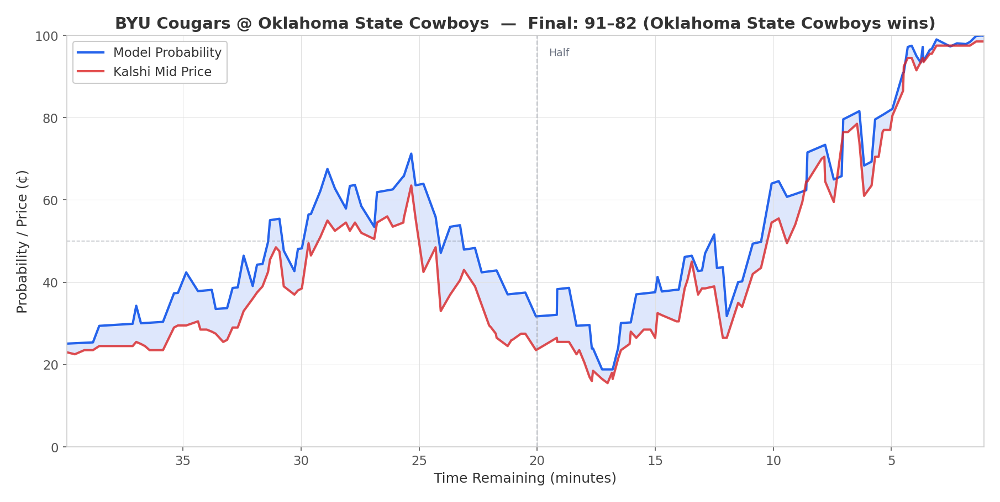
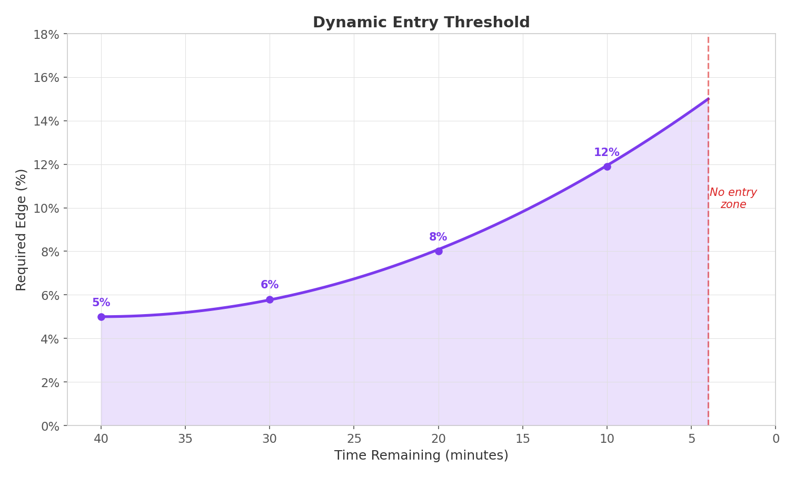
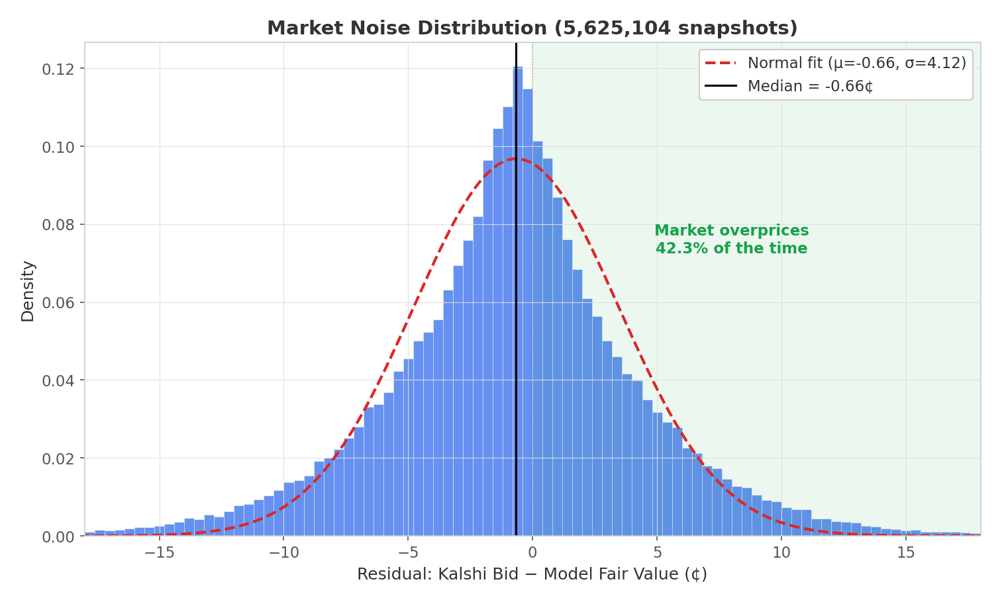
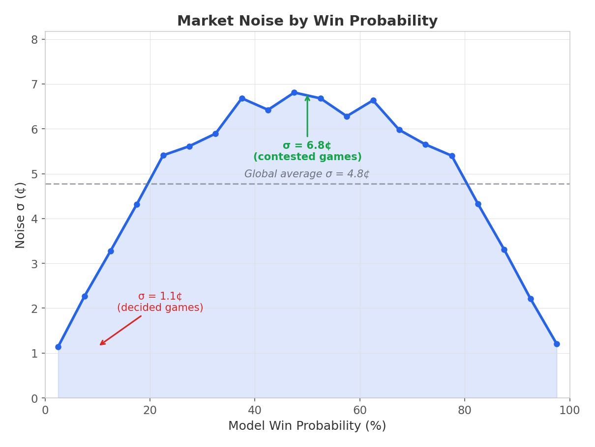
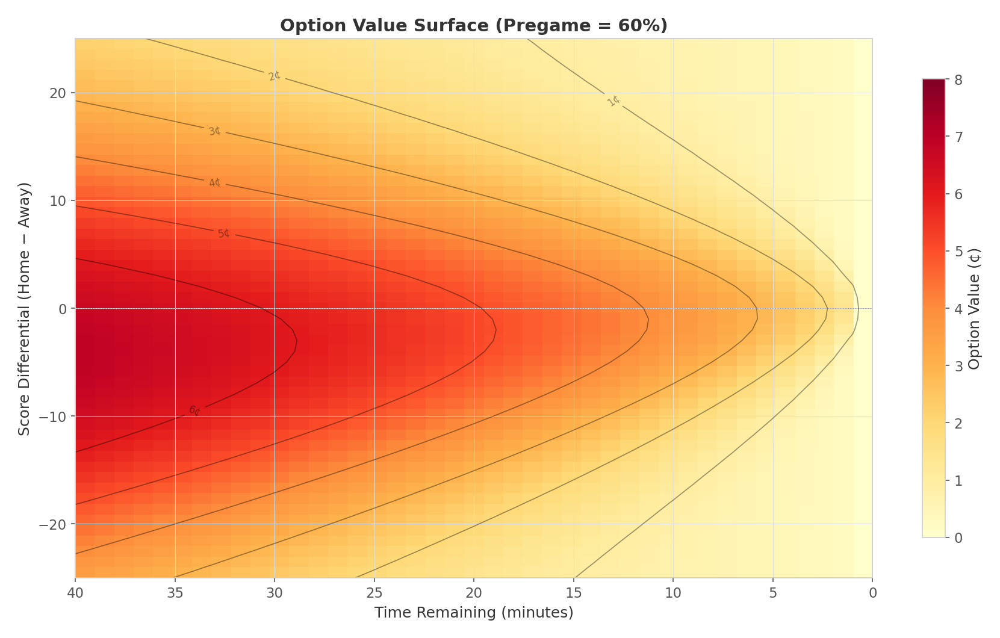
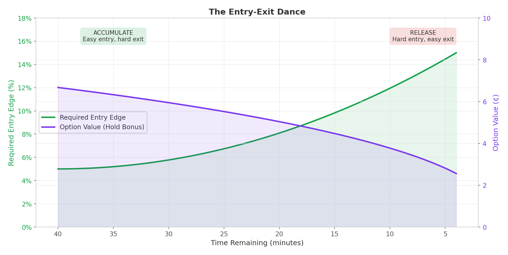
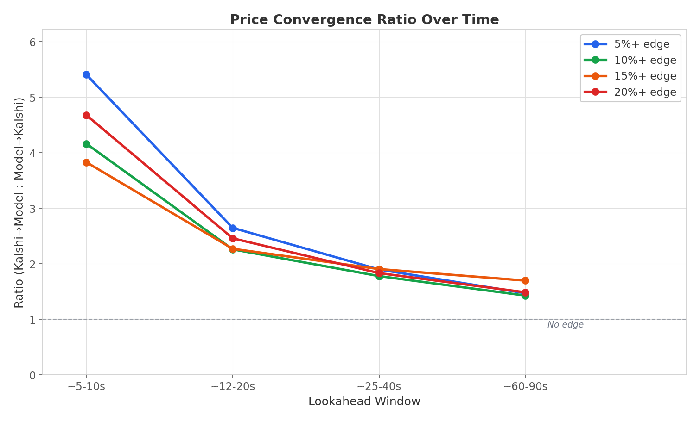

# Live Trading College Basketball: An Options-Based Approach to Prediction Markets

Every college basketball game on Kalshi is a tradeable binary contract — \$1.00 if the team wins, \$0.00 if they lose. This system trades them automatically in real-time: maintaining continuously updating win probabilities for every live game, evaluating entry and exit decisions against dynamically calibrated thresholds, and executing trades at sub-second latency. Each position is treated as an American-style option with quantifiable embedded value.

The key insight driving the system is that every position carries embedded optionality — the right to sell only when the market overprices in your favor. Free settlement amplifies that value by making the hold decision costless. What follows is a detailed treatment of the probability model, the options-based position management framework, and the infrastructure required to operate it all in production.

---

## The Setup: What We're Trading

Kalshi offers binary contracts on college basketball games. A contract pays \$1.00 if the team wins, \$0.00 if they lose. Each game has four tradeable instruments: YES and NO contracts for both teams. The market operates with a bid-ask spread, and Kalshi charges a fee of 7% × P × (1-P), capped at 1.75¢ per contract.

The goal: buy contracts when our model says they're underpriced, hold them intelligently, and either sell when the market overprices them or let them settle at game end for free.

That last part — 'settle for free' — turns out to shape the entire system. Not because it's the only source of optionality, but because it makes the option to hold nearly costless.

---

## The Live Probability Model

Before we can trade, we need to know what a contract is worth. The system maintains a continuously updating win probability for every live game, refreshed every second.

The model starts with a pregame prediction — a win probability generated by an ensemble of machine learning models trained on 80,000+ historical games. That pregame probability gets projected into margin space using the inverse normal distribution:

```
pregame_implied_margin = Φ⁻¹(pregame_prob) × σ
```

This isn't recovering the model's raw predicted margin — the pregame probability comes from a multi-feature logistic regression, and there's no clean inverse back to a single number. Instead, σ is a free parameter that controls how strongly the pregame prediction persists against live scoring information as the game unfolds. Its value — 17.2, learned by minimizing Brier score across play by play data from 4,000+ games — determines the balance: too low and the model abandons its pregame view at the first scoring run; too high and it stubbornly clings to a prediction the game has already invalidated.

The construction is self-consistent: at tipoff, with score 0-0 and full time remaining, the σ cancels and the model outputs exactly the pregame probability. As the game progresses, the live score gradually takes over.

Once the game tips off, the model tracks how much of that expected edge remains. The key insight: as time passes, uncertainty shrinks. With 40 minutes left, anything can happen. With 4 minutes left, the outcome is largely determined by the current score.

The updating formula:

```
expected_final_margin = current_score_diff + (pregame_implied_margin × time_fraction)
remaining_std = σ × √(time_fraction)
live_win_prob = Φ(expected_final_margin / remaining_std)
```

The square root scaling on remaining standard deviation is crucial — it captures how volatility decays as the game progresses. A 10-point deficit at halftime is very different from a 10-point deficit with 2 minutes left.



---

## Entry Logic: When to Buy

The system enters a position when it sees sufficient edge between the model's probability and the market's price:

```
edge = model_probability - market_ask_price
```

If our model says Duke has a 65% chance to win but the market sells that contract for 55¢, we have a 10% edge.

But not all edges are created equal. Early in a game, when market makers are still calibrating and our macro-level model has the advantage, a 5% edge is meaningful. Late in a game, when micro-state information dominates (who has possession, foul counts, timeout situations), that same 5% edge is more likely to be noise.

The system uses a dynamic edge threshold that ramps exponentially:

```
required_edge = 5% + ((40 - minutes_remaining) / 36)² × 10%
```

| Time Remaining | Required Edge |
|----------------|---------------|
| 40:00 (tipoff) | 5.0% |
| 30:00 | 5.8% |
| 20:00 | 8.0% |
| 10:00 | 11.9% |
| 4:00 | 15.0% |



Additional entry filters ensure we only take high-quality trades:

| Filter | Requirement | Rationale |
|--------|-------------|-----------|
| Spread | ≤ 3¢ | Tight markets = lower transaction costs |
| Price | 10¢ – 90¢ | Avoid extreme odds where fees dominate |
| Time | ≥ 4 minutes | Don't trade the chaotic final minutes |
| Score freshness | ESPN score change within 15 seconds | Prevents phantom edges from stale data |

Before entering, the system optimizes across all four contract types. To enter a long position on the home team, it compares the HOME YES ask against the AWAY NO ask and takes whichever is cheaper. This YES/NO optimization consistently saves 1-3¢ per trade in illiquid markets.

---

## The Option Value Framework

Here's where it gets interesting. Once you own a position, you face a continuous decision: sell now or keep holding?

The naive approach compares expected values:

```
EV_sell = bid - fees
EV_hold = model_probability × 100¢
```

But this misses something crucial: **settlement is free**. If you hold to game end, you pay zero exit fees. If you sell mid-game, you pay up to 1.75¢ in fees.

This asymmetry makes the case obvious, but the deeper point doesn't depend on fees at all. Even in a zero-fee market, you have the **right but not the obligation** to sell at any point. You'll only sell when the bid exceeds your continuation value — and the expected value of "sell only when it's profitable, hold otherwise" is strictly greater than the expected value of holding to settlement, as long as there's any noise in the market. That's the fundamental option payoff: E[max(bid - continuation, 0)] > 0 whenever market noise exists.

The fee asymmetry just widens the gap. The naive approach says "sell whenever the bid exceeds fair value," but fees eat into those marginal sells. Free settlement raises the bar for exercising the option — you need the market to overprice by enough to justify the transaction cost — which makes the hold decision correct more often than it would be in a frictionless market.

This is mathematically identical to an American-style option. And like any option, it has quantifiable value.

---

## Measuring Market Noise

The option's value depends on how much the market bounces around. If Kalshi's bids always sat exactly at fair value, the option to sell would be worthless — you'd never get a better price than holding.

But markets are noisy. Sometimes the bid sits above model fair value, and you can sell at a profit.

I measured this empirically using 930,000+ in-game snapshots, capturing the bid price and model probability every second:

```
residual = kalshi_bid - (model_probability × 100)
```



The global results:

| Statistic | Value |
|-----------|-------|
| Median | -0.53¢ |
| Std (IQR-based, robust) | 4.02¢ |

The negative median confirms that bids typically sit below model fair value — that's the spread. The standard deviation of 4.02¢ captures the noise around that baseline.

How often does the market actually overprice in our favor?

| Overpricing Threshold | Frequency |
|-----------------------|-----------|
| bid > model | 43.8% |
| bid > model + 2¢ | 25.7% |
| bid > model + 4¢ | 15.2% |
| bid > model + 6¢ | 8.5% |
| bid > model + 8¢ | 4.6% |

About 15% of the time, the market bids 4¢+ above our model's fair value. That's the optionality we're capturing.

But the global average obscures something important: **noise is not constant across probability levels.** When I conditioned the residual analysis on the model's win probability at each snapshot, a striking pattern emerged.



| Model Probability | Noise σ | Ratio vs ATM |
|-------------------|---------|-------------|
| 10% (decided game) | 2.6¢ | 0.39x |
| 30% | 5.7¢ | 0.85x |
| 50% (contested) | 6.7¢ | 1.00x |
| 70% | 5.7¢ | 0.85x |
| 90% (decided game) | 2.7¢ | 0.40x |

Market noise varies by over 5x depending on how contested the game is. In close games, there's genuine disagreement between participants about the outcome, and the bid bounces around substantially. In decided games — where the model gives one side 90%+ — everyone agrees on the price, and the bid barely moves.

This has a direct consequence for option value. A position in a contested game has many potential sell opportunities from large noise fluctuations. A position in a decided game has very few — the bid is pinned near the model's fair value and rarely deviates enough to make selling worthwhile.

---

## Pricing the Option: From Backward Induction to Closed-Form

With market noise measured, we need to compute the option value at any game state. The rigorous approach is backward induction — the same dynamic programming technique used to price American options on binomial trees.

**Terminal condition (game end):**
```
Win  → receive 100¢ (free settlement)
Lose → receive 0¢ (free settlement)
```

**At each earlier timestep, working backward:**

The position's value equals the expected continuation value plus a "sell premium" — the expected gain from being able to sell only when the market overprices:

```
V(state, time) = E[V(next_state, time-1)] + sell_premium
```

The sell premium at each step is a call option on the bid price. If the bid is normally distributed around fair value, the premium from selling only when profitable follows the standard option payoff formula:

```
sell_premium = σ(p) × φ(d) + (μ_sell - continuation) × Φ(d)
```

Where σ(p) is the probability-conditioned market noise at the current state, and μ_sell is the expected sell proceeds net of fees. This is the exact same mathematics as a European call — the expected value of max(bid - continuation, 0) under a normal distribution.

Critically, the backward induction uses the conditional noise measured earlier — σ(p) rather than a single global σ. At each node, the sell premium is computed using the noise level appropriate for that probability. A node at p = 0.50 sees σ = 6.7¢ and gets substantial sell premium. A node at p = 0.90 sees σ = 2.7¢ and gets much less. This means the BI naturally produces lower option values for positions in decided games and higher values for contested ones — the asymmetry emerges from the physics rather than being imposed after the fact.

But there's a subtlety. Backward induction treats every timestep as an independent sell opportunity. In reality, market noise is autocorrelated — a mispricing at time *t* is partially correlated with the mispricing at *t + 30 seconds*. If you use 30-second steps, you'd be counting correlated opportunities as independent, inflating the option value.

To calibrate the right timestep, I measured the autocorrelation structure of bid-model residuals across 930,000+ snapshots:

| Lag | Autocorrelation |
|-----|-----------------|
| 15s | 0.54 |
| 30s | 0.46 |
| 60s | 0.40 |
| 120s | 0.29 |
| 300s | 0.19 |

At 120-second intervals, autocorrelation drops to 0.29 — roughly 8% shared variance between consecutive steps, which is low enough to treat as approximately independent. A 40-minute game at DT=120 gives 20 approximately independent sell opportunities.

Running backward induction at this calibrated timestep produces an option value surface across every combination of score differential, time remaining, and pregame probability. But deploying a 3D lookup table in production introduces file dependencies, grid discretization artifacts, and interpolation edge cases.

### The Closed-Form Formula

Instead, I fit a three-parameter closed-form formula to the backward induction output — 34,000+ grid points — achieving an RMSE of 0.34¢:

```
OV = 0.39 × N^0.42 × (1 + 16.12 × p(1-p))
```

Where:
- **N = time_remaining / 120** — the number of independent sell opportunities remaining
- **p** — the model's current win probability for our side

This is analogous to the relationship between the binomial tree and Black-Scholes. The binomial tree (backward induction) solves the problem exactly on a discrete grid. Black-Scholes (the formula) captures the same economics in closed form — no grid, no file, no lookup. Nobody would say Black-Scholes isn't real option pricing; it's just a different solution method. Same situation here.

Each term has a clear financial interpretation:

**N^0.42** — Sublinear growth in sell opportunities. Doubling your remaining time doesn't double your option value, because you only need *one* good exit. Same reason buying 10 lottery tickets isn't 10x as valuable as buying one. The 0.42 exponent emerges naturally from the diminishing marginal value of additional independent draws from a noise distribution.

**0.39** — The base scale factor per sell opportunity, reflecting the expected positive part of the noise distribution discounted by the negative mean bias (bids typically sit below fair value) and the cost of exercising.

**(1 + 16.12 × p(1-p))** — The noise shape adjustment. This is the dominant term and directly reflects the conditional noise structure: p(1-p) peaks at p = 0.50 and drops to zero at the extremes, exactly mirroring the empirical σ(p) curve. In a contested game (p near 0.50), market noise is large and sell opportunities are abundant, so option value is high. In a decided game (p near 0 or 1), the market barely moves and there's little optionality to capture. At p = 0.50, this multiplier reaches its maximum of 5.03×; at p = 0.90, it drops to 2.45×.

The formula is re-calibrated periodically as more market data accumulates — measuring fresh conditional noise parameters σ(p), running backward induction with probability-dependent noise at DT=120, and refitting the three coefficients.



| Score Diff | 40:00 | 20:00 | 10:00 | 5:00 | 2:00 |
|------------|-------|-------|-------|------|------|
| +15 | 3.9¢ | 2.2¢ | 1.1¢ | 0.6¢ | 0.4¢ |
| +10 | 4.9¢ | 3.2¢ | 1.9¢ | 0.9¢ | 0.4¢ |
| +5 | 6.0¢ | 4.3¢ | 3.0¢ | 1.9¢ | 0.9¢ |
| 0 | 6.7¢ | 5.1¢ | 3.8¢ | 2.9¢ | 2.0¢ |
| -5 | 6.9¢ | 5.0¢ | 3.5¢ | 2.2¢ | 1.0¢ |
| -10 | 6.5¢ | 4.2¢ | 2.3¢ | 1.1¢ | 0.4¢ |
| -15 | 5.7¢ | 3.1¢ | 1.4¢ | 0.7¢ | 0.4¢ |

Key observations:
- Option value peaks in contested games (score near 0) where market noise is highest — around 5-7¢ with substantial time remaining
- It decays sublinearly — even with 5 minutes left, close games still carry 2-3¢ of optionality
- Lopsided scores have *lower* option value. When the game is decided, the market barely moves and there's little optionality to capture. A +15 position at halftime has only 2.2¢ of option value compared to 5.1¢ for a tied game — reflecting the 5.5× difference in market noise between decided and contested games

---

## Exit Logic: The Complete Picture

With option value quantified, the exit decision becomes precise:

```
EV_hold = model_probability × 100 + option_value(time, model_prob)
EV_exit = bid - exit_fee
        = bid - min(7% × bid × (1-bid), 1.75¢)

Exit if: EV_exit > EV_hold
```

Rearranging:

```
Exit if: bid > model × 100 + option_value + fee
```

**Example:** 20 minutes remaining, score tied, model says 60% win probability.

```
Option value = 5.0¢ (from formula: 0.39 × 10^0.42 × 4.87)
Exit threshold = 60 + 5.0 + 1.7 = 66.7¢
```

We only sell if Kalshi bids above 67¢ — nearly 7¢ above our model's fair value. The market needs to meaningfully overprice for us to give up the remaining optionality in a contested game. But with 20 minutes left and the game up by 15 (model probability ~93%), the option value drops to just 2.2¢ and the exit threshold tightens — we're quicker to lock in profits when the market has little room to move.

---

## The Entry-Exit Dance

The entry and exit curves are deliberately complementary:

| Game Phase | Entry | Exit |
|------------|-------|------|
| Early (40-30 min) | Easy (5% edge) | Hard (high option value) |
| Mid (30-10 min) | Moderate (6-10% edge) | Moderate |
| Late (10-4 min) | Hard (12-15% edge) | Easier (low option value) |



This creates the right behavior:
- **Early game:** Enter aggressively when our model has informational advantage, hold patiently through noise
- **Late game:** Tighten entry requirements as micro-state info dominates, loosen grip on existing positions

The curves cross shortly after halftime — the inflection point where we shift from "accumulate and hold" to "protect and release."

---

## Infrastructure: Speed Meets Safety

The system polls ESPN's scoreboard API and Kalshi's market data in parallel every second. But REST APIs have a problem: latency. ESPN updates lag the real game by 10-20 seconds, and stale prices create phantom edges.

The most dangerous form of this is adverse selection on the ESPN side. A basket is scored, Kalshi's market makers adjust prices instantly (they have faster data feeds), but ESPN's API hasn't reported the score change yet. The system's model — still using the old score — sees a gap between its probability and Kalshi's price and interprets it as edge. It enters the position. Seconds later, ESPN catches up, the model recalculates, and the "edge" vanishes. The same mechanism works in reverse for exits: the model sees its probability shift against a position and triggers a sell, when in reality the score hasn't changed and the position is still good.

The solution is a score freshness guard applied to both entries and exits. The system tracks when ESPN last reported an actual score change for each game. If no score change has occurred within a configurable window (currently 15 seconds), both entry and exit decisions are blocked. The reasoning: if ESPN hasn't reported a basket recently, any discrepancy between the model and the market is more likely to reflect information the market has that we don't — not genuine edge.

WebSocket integration with Kalshi's orderbook addresses the other side — ensuring the market prices themselves are fresh rather than stale REST snapshots.

Additional safety mechanisms:

| Safeguard | Implementation |
|-----------|----------------|
| ESPN score freshness | Block entries and exits when no score change in last 15 seconds |
| Kalshi data freshness | Reject trades when WebSocket data > 5 seconds old |
| Bad data detection | Reject ESPN updates where scores decrease |
| Exit cooldown | 30-second pause on exited team to prevent whipsaw |
| Position verification | Query Kalshi API after every sell to confirm closure |

In live mode, Kalshi is the sole source of truth. Entry prices, fill counts, and position existence come from the exchange API, not internal databases. The local database serves as a write-only log for post-session analysis.

---

## Proving the Edge

Having a model that disagrees with the market means nothing if you're wrong. The critical test: when the model and market disagree, who moves toward whom?

Using the same snapshot data that calibrated market noise, the system tracks price convergence. For every moment where the model sees a significant edge, it records what happens next. Does Kalshi move toward the model? Or does the model move toward Kalshi?



The convergence ratio — how often the market moves toward the model versus the reverse — is measured across multiple lookahead windows to distinguish genuine predictive signal from transient noise:

| Edge Threshold | ~5-10s | ~12-20s | ~25-40s | ~60-90s | n |
|----------------|--------|---------|---------|---------|---|
| 5%+ | 2.9:1 | 2.1:1 | 1.7:1 | 1.4:1 | 275,623 |
| 10%+ | 2.4:1 | 1.8:1 | 1.6:1 | 1.3:1 | 66,263 |
| 15%+ | 2.6:1 | 1.9:1 | 1.7:1 | 1.3:1 | 15,746 |
| 20%+ | 3.6:1 | 2.5:1 | 2.0:1 | 1.3:1 | 5,699 |

Two patterns emerge. First, the ratio increases with edge size at every lookahead window — at 20%+ disagreement, the market converges toward the model over 3.5x more often than the reverse within 5-10 seconds. Second, the ratio decays as the lookahead window extends, which is expected: the model's informational advantage gets priced in over time as the market absorbs the same signal.

Critically, the ratio remains above 1.0 at every threshold and every window. Even at 60-90 seconds, all edge buckets still show convergence ratios of 1.3:1 or higher. This is the signature of genuine predictive alpha — noise or stale data would produce ratios at or below 1.0, particularly at longer horizons.

*From 286 games, ~276,000 edge observations. Continuously monitored as data grows.*

---

## The Complete System

Putting it all together:

**Entry:**
```
Enter if:
  edge ≥ required_edge(time)     # 5% early → 15% late
  spread ≤ 3¢
  10¢ ≤ price ≤ 90¢
  time_remaining ≥ 4 minutes
  ESPN score updated within 15 seconds
  not in cooldown
```

**Exit:**
```
Exit if:
  bid - fee > model × 100 + option_value(time, model_prob)
  ESPN score updated within 15 seconds
  
Or at settlement:
  Receive 100¢ if win, 0¢ if lose (free, no fees)
```

**Option value** is computed via closed-form formula calibrated to backward induction using probability-conditioned market noise — σ(p) ranges from 2.6¢ in decided games to 6.7¢ in contested ones. The formula is periodically re-fit as snapshot data grows.

The system runs autonomously. A cron job at 4 AM processes completed games and regenerates predictions. The live trader fires up before tip-off, subscribes to WebSocket feeds, and makes rational EV-maximizing decisions every second until the last game settles.

---

## What Makes This Work

The edge comes from three sources:

1. **A better model** — The pregame ensemble captures information the market underweights, particularly early-season when data is scarce.

2. **Options-based position management** — By quantifying the embedded optionality of each position — the value of selectively exiting only when the market overprices — the system avoids the costly churn of selling and re-entering positions.

3. **Speed and safety** — WebSocket integration, score freshness guards, and verification loops ensure the system trades on real edges, not stale data artifacts. Both entries and exits are gated on recent ESPN score updates to prevent adverse selection from the 10-20 second lag between live action and the API.

The pregame model provides the directional view. The options framework turns that view into a trading strategy. The infrastructure executes it cleanly.

Everything else is just math and discipline.